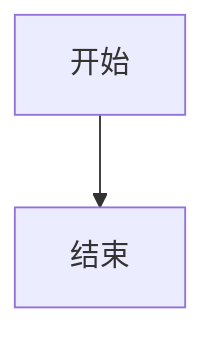
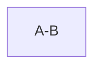
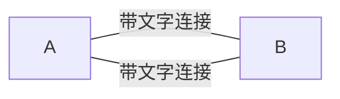
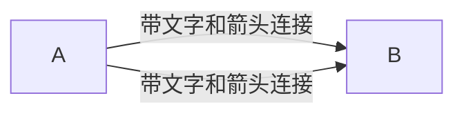
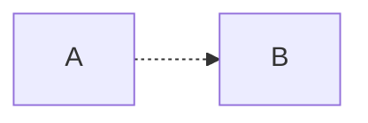
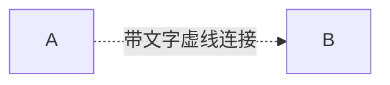
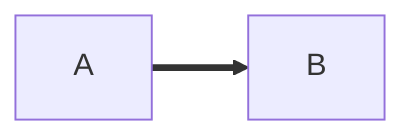
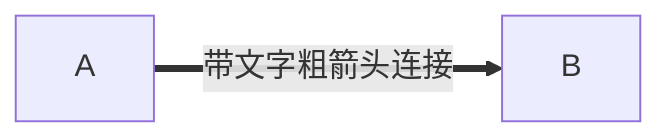

# 《了不起的MarkDown》笔记

最近换用了Joplin笔记软件，跟着这本书系统学一下用markdown写作。本文是学习记录，边读边在Joplin安卓手机客户端编辑器里实操。
技术的用途，是用出来的。
markdown相当于简化的HTML，适合于对排版没有太高要求的场合。它是专注写作的最佳方案。
其实Markdown最难的地方并不是语法，而是开始使用。

## markdowm基本语法

### 一、标题，有底线版和#号版


底线版一级标题
===========
底线版二级标题
-----------

底线符号至少2个，只支持这两种。

# 一级标题
## 二级标题
### 三级标题
#### 四级标题
##### 五级标题
###### 六级标题
#号后要跟一个空格

建议使用#号版的。
除非在文章开头，建议标题前后都空一行。

## 像这样

不要有多余的空格，结尾别放空格。不建议加标点符号。
推荐的文档结构

# 文档标题

作者

摘要

目录

## 标题1

### 标题1.1

# 标题2

## 标题2.1

## 标题2.2

### 二、粗体斜体
用*或_包裹，一个为斜体，两个为粗体。
**这是粗体**
_这是斜体_
建议用*，在其内部，不建议加空格。

### 三、段落与换行
行与行之间没有空格，视为同一段落。有空行则视为不同段落。空行指行内只有空格或制表符，其它什么也没有。段内换行，上一行结尾插入两个以上空格并回车。

## 没有空行
我是第一行。
我是第二行。

## 有空行
我是第一行。

我是第二行。

# 段内换行
我是第一行。  
我是第二行。

# 非段内换行
我是第一行。 
我是第二行。

### 四、列表
有序列表: 数字序号+英文句号+空格+列表内容
1. 内容1
2. 内容2
3. 内容3

无序列表:*/+/- + 空格 + 列表内容
* 无序列表1
+ 无序列表2
- 无序列表3

嵌套列表，用Tab键开头
+ 第一层列表
我这里手机输不了Tab。
建议使用-标记无序列表。

### 五、分隔线
用三个以上*/-/_来标记。
下面是分隔线
***
---
___

### 六、插入图片

图片地址可以是本地路径也可以是网络路径，本地路径支持相对路径和绝对路径。

### 七、链接
文字链接 
[这是我的博客](https://zwdnet.github.io)

引用链接
[这是我的博客](MyBlog)
[MyBlog]:https://zwdnet.github.io

当链接地址为网络地址时需以http或https开头。

网址链接
<https://zwdnet.github.io>

### 八、行内代码与代码块
行内代码使用\`包裹
`行内代码`

    代码块以四个Tab或空格开头
    print("hello")

GFM提供了扩展代码块
```python
    # 围栏代码块
    print("hello markdown")
```

### 九、引用
使用>+引用内容来表示。

> 这是引用的内容。

> 多行引用1
> 多行引用2
> > 嵌套引用1
> > 引用中使用其它**标记**

### 十、转义符
用\

## GFM(GitHub Flavored Markdown)扩展语法
### 一、删除线
用~~包裹
~~这是删除线~~

### 二、表情符号
用:包裹
:smile:
:laughing:
:+1:

### 三、自动链接
同前

### 四、表格
单元格使用|分割，表头与其它行使用-来分隔。
对齐方式
左对齐(默认) ::
右对齐 -:
居中对齐 :-:
块级元素不能插入。
|姓名|年龄|性别|
|:--:|--:|---|
|张三|25|男|
|李四|28|女|
|王五|45|女|

### 五、任务列表

- [ ] 未勾选
- [x] 已勾选

### 六、围栏代码块
同前

### 七、锚点
在文档中跳转
[锚点描述](#锚点名)
锚点名不能含有空格或特殊符号。

[第一章](#标题1)
[第二章](#标题2)


## 排版技巧

### 关于空格
加空格的情况
建议中文和英文之间加空格，中英文和数字之间加空格。英文标点符号与之后的字符之间加空格，与之前的字符之间不需要加空格。使用>(半角)标识路径时前后都需要加空格。中文标点符号之后不需要加空格。
不加空格的情况
数字和％之间不需加空格。数字和单位之间。英文和数字组合成名字之间。使用/表示“或“或者“路径”时，前后都不加。货币符号后不加空格。

### 全角和半角
在中文排版中，使用全角。在英文排版中，使用半角。

### 英文大小写
专有名词使用正确的大小写。

接下来介绍Typora和VS code两个编辑器，略过了。
Joplin还支持Mermaid流程图，试试。

## Mermaid流程图

这部分参考[这里](https://blog.csdn.net/qq_36221177/article/details/95342462)

### 1.图形

图形布局分为上下(TD)/下上(DT)/左右(LR)/右左(RL)四种。必须大写。



### 2.节点和形状
1. 带文字节点
idN[该节点内容]，不同的括号样式代表不同的节点样式。

2. 节点形状


### 3.节点之间的连接
#### 3.1.实线箭头连接


#### 3.2.开放连接(没有箭头)

一个横线

#### 3.3.连接上加文字

横线数量必须如此。

#### 3.4.连接上加文字和箭头

横线数量必须如此。

#### 3.5 虚线连接


#### 3.6 带文字虚线连接


#### 3.7 粗箭头连接


#### 3.8 带文字粗箭头连接


[md文件下载](https://zymblog-1258069789.cos.ap-chengdu.myqcloud.com/blog0267-markdown/paper.md)


我发文章的三个地方，欢迎大家在朋友圈等地方分享，欢迎点“在看”。
我的个人博客地址：https://zwdnet.github.io
我的知乎文章地址： https://www.zhihu.com/people/zhao-you-min/posts
我的微信个人订阅号：赵瑜敏的口腔医学学习园地


